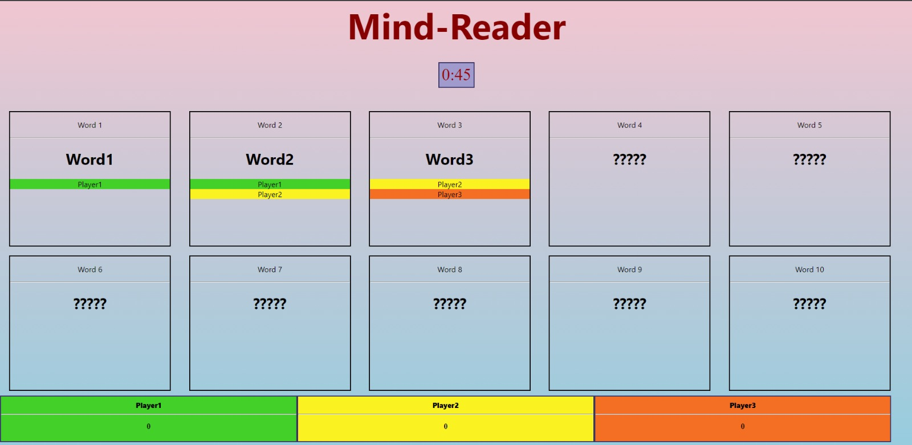

# Mind-Reader
A simple Website that I bodged within a week to host a virtual pints evening with friends. 

Mind-Reader is a game inspired by the gameshow `10 Gegen Willy` from PietSmiet. A moderator takes a player into a breakout room and the player is presented a category. He then has to come up with 10 words related to that category. Once he has selected the words, the other players have - one at a time - 45 seconds to guess as many words as possible.
For each word that was guessed correctly, both players get a point.

When playing as a host, new words can be entered on the top left. Initially, players will only see **???** for the words (indicated by the red box around the word). If the host clicks on a word, the box will turn green and all players can see the word (and the correct guesses). Guesses can be toggled in the same way by clicking the players name under the word. 

Further, the host can remove players, words, reset all words and update a players score with the respective buttons.



## Disclaimer
I am not a web-developer and this is the first time that I am using React/Socket io. Consequently, the website probably does not follow industry standards and requires some manual maintenance. 
- Players are stored in cache. If someone logged in as a host, the only way to remove hosts is to restart the node server. Players can be removed by a host.
- If a user wants to change his name or switch from host to player/player to host, he has to clear the cookies set by the website. 
- Scores are reset when a user reloads the page 
- The website layout might not work on all devices/break for large player numbers

## Installation

In order to setup the website, we need to install the dependencies of the socket io and Reactjs part:

### Socket io
To install socket io, clone the project and navigate to the `mind-reader`-folder, using the command
```shell
cd mind-reader
```
Install the dependencies with 
```shell
npm install
```

To start the node server, run  

```shell
node server.js
```
(from the `mind-reader`-folder)
If executed successfull, you should see `Listening on port 4001` in the console.

### React js

Installing React js works quite similar. In a different console window, navigate to the folder `socket-client` inside of the `mind-reader`-folder. Run `npm install` to install the dependencies.

To start the React app, run
```shell
npm start
```

Finally, to connect the React js and socket io parts of the app, replace **localhost** in `socket-client\src\service\socket.js` with the ip address of your server (I haven't tested domains)


## Demonstration
Login and adding words


Revealing words and guesses


Multiple players


